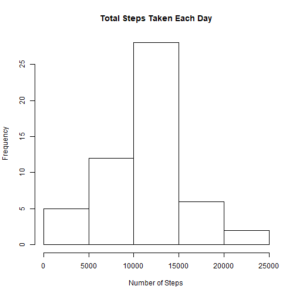
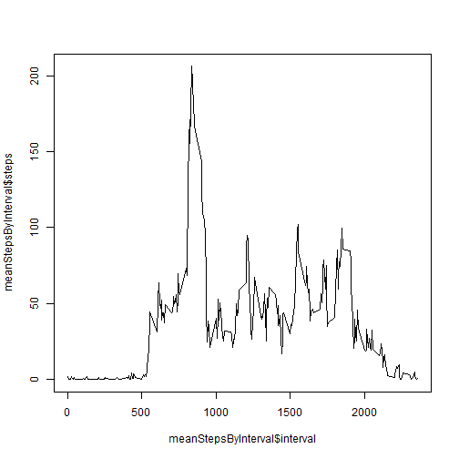
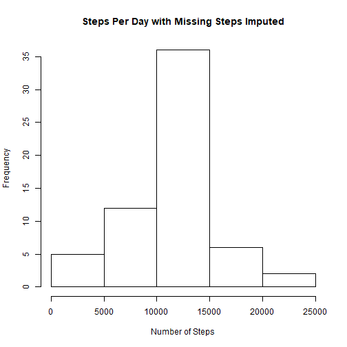
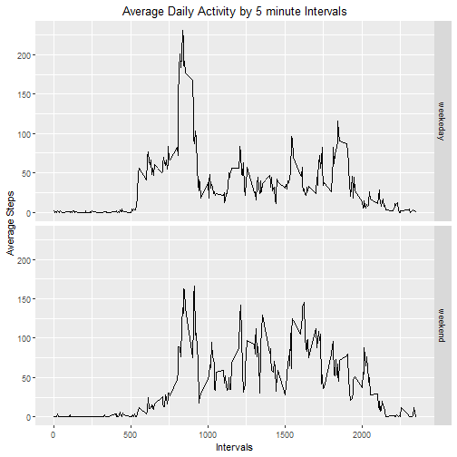

#1-Code for reading in the dataset and/or processing the data


```r
activityData <- read.csv(file="activity.csv", header=TRUE)
```

#2-Histogram of the total number of steps taken each day


```r
totalSteps <- aggregate(steps ~ date, activityData, FUN=sum)

hist(totalSteps$steps,
     main = "Total Steps Taken Each Day",
     xlab = "Number of Steps")
```



#3-Mean and median number of steps taken each day


```r
meanSteps <- mean(totalSteps$steps, na.rm = TRUE)
medSteps <- median(totalSteps$steps, na.rm = TRUE)
print (meanSteps, type="html")
```

```
## [1] 10766.19
```

```r
print (medSteps,type="html")
```

```
## [1] 10765
```

#4-Time series plot of the average number of steps taken


```r
meanStepsByInterval <- aggregate(steps ~ interval, activityData, FUN=mean, na.rm=TRUE)

plot(meanStepsByInterval$interval, y = meanStepsByInterval$steps, type = "l")
```


  
#5-The 5-minute interval that, on average, contains the maximum number of steps


```r
maxInterval <- meanStepsByInterval[which.max(meanStepsByInterval$steps),]
print (maxInterval, type="html")
```

```
##     interval    steps
## 104      835 206.1698
```

#6-Code to describe and show a strategy for imputing missing data


```r
missingValues <- is.na(activityData$steps)
totalmissing<-sum(missingValues)
print (totalmissing, type="html")
```

```
## [1] 2304
```
Approach: Impute missing data by using 5 day average(mean) for that interval

#7-Histogram of the total number of steps taken each day after missing values are imputed

Step 1: Create a new dataset that is equal to the original dataset but with the missing data filled in.


```r
activityDataNA <- transform(activityData, steps=ifelse(is.na(activityData$steps),   meanStepsByInterval$steps[match(activityData$interval,meanStepsByInterval$interval)],activityData$steps))
```

Step 2: Make a histogram of the total number of steps taken each day. 


```r
StepsByIntervalNA <- aggregate(steps ~ date, activityDataNA, FUN=sum)
hist(StepsByIntervalNA$steps,
     main = "Steps Per Day with Missing Steps Imputed",
     xlab = "Number of Steps")
```



Step 3: Calculate and report the mean and median total number of steps taken per day.


```r
ImpactedMeanSteps <- mean(StepsByIntervalNA$steps, na.rm = TRUE)
ImpactedMedSteps <- median(StepsByIntervalNA$steps, na.rm = TRUE)
MeanDif = ImpactedMeanSteps - meanSteps
MedDif = ImpactedMedSteps - medSteps
```
Conclusion: as the mean difference between the 2 datasets is 0, and median difference is minimal at 1.18 steps per interval, the impact of imputing the missing data is minimal.

#8-Panel plot comparing the average number of steps taken per 5-minute interval across weekdays and weekends

Step 1 - Create a new factor variable in the dataset with two levels - weekday and weekend indicating whether a given date is a weekday or weekend day.


```r
DayType <- function(date) {
  day <- weekdays(date)
  if (day %in% c('Monday', 'Tuesday', 'Wednesday', 'Thursday', 'Friday'))
      return ("weekeday")
  else if (day %in% c('Saturday', 'Sunday'))
      return ("weekend")
  else
      stop ("Invalid Date Format.")
}
activityDataNA$date <- as.Date(activityDataNA$date)
activityDataNA$day <- sapply(activityDataNA$date, FUN = DayType)
```

Step 2 - Make a panel plot containing a time series plot of the 5-minute interval (x-axis) and the average number of steps taken, averaged across all weekday days or weekend days (y-axis). 


```r
library(ggplot2)
```

```
## Warning: package 'ggplot2' was built under R version 3.5.2
```

```r
meanStepsByDay <- aggregate(steps ~ interval + day, activityDataNA, mean)
ggplot(data = meanStepsByDay, aes(x = interval, y = steps)) + 
  geom_line() +
  facet_grid(day ~ .) +
  ggtitle("Average Daily Activity by 5 minute Intervals") +
  xlab("Intervals") +
  ylab("Average Steps") +
  theme(plot.title = element_text(hjust = 0.5))
```



Conclusion: Average steps appear to be higher on weekdays than weekend. However, frequency of higher average steps is observed more on weekends than weekdays.
